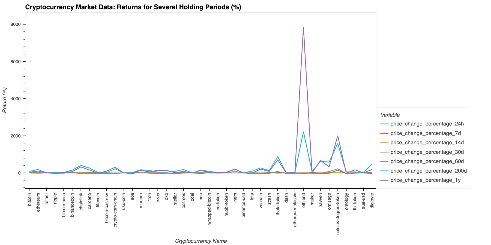
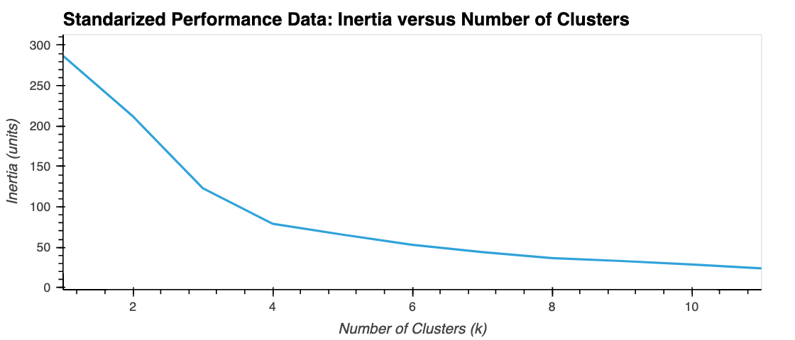
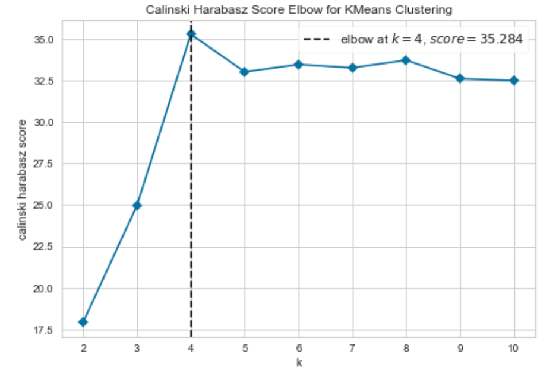
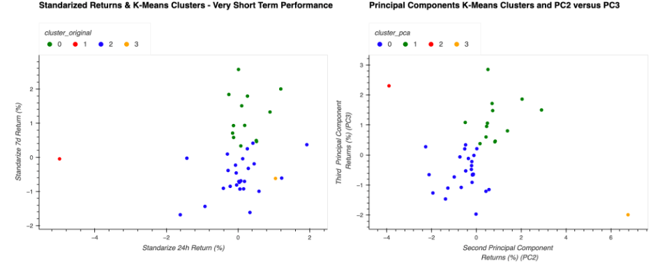
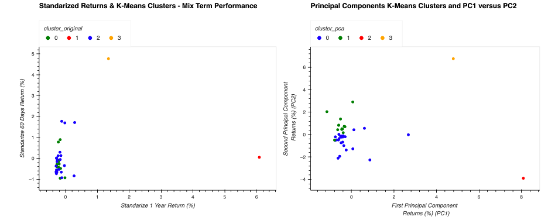
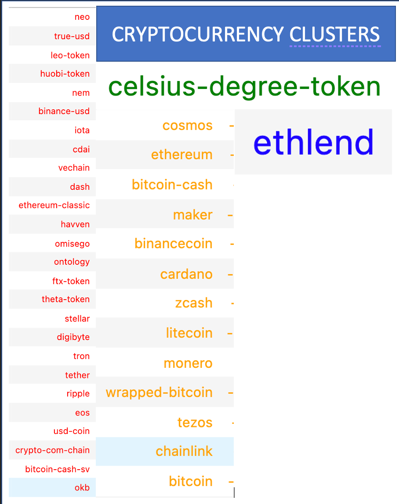

# Crypto Clustering

This code applies *K-Means* and *Principal Component Analysis (PCA)* to cluster cryptocurrencies based on performance over 7 different holding periods.

The analysis could be replicable to other financial series, with large amount of data thanks to the use of PCA, which reduces the dimentionality of the data.

The analysis found the same number and composition of clusters (4) when using the original standarized data of 7 series of returns than when using its 3 principal components. These three principal components explained 90% of the variance of the cryptocurrencies' returns.
___

## Technologies
Technologies used in the analysis are:

> **Scikit-learn** machine learning tools for the unsupervised data analysis. Tools such as `Cluster`, `StandardScaler`, `Preprocessing`, `Decomposition`, and `KElbowVisualizer` for Kmeans, Data Standarization, and Principal Component Analysis. 

> **Pandas**, **NumPy** and **Path** libraries for general coding, 

> **hvPlot**, **Plotly Express**, **Holoviews** for visualizations

___
## Instalation Guide
The file is a jupyter notebook. If you don't have jupyter notebook, you can install it following the instruction here:

https://jupyterlab.readthedocs.io/en/stable/getting_started/installation.html


In case you need to install scikit-learn or hvPlot, you can use:
```Python
        pip install -U scikit-learn
        conda install -c pyviz hvplot
```
___

### Usage

The main file is:

```Python
        crypto_investments.ipynb 
````
    
which is a Jupyter Notebook with a pre-run code. You can go through it and see code as well as results. 

If you look to reuse the code, and do not have experience on jupyter lab, you can refer [this tutorial.](https://www.dataquest.io/blog/jupyter-notebook-tutorial)

For information about K-Means, inertia definition, and other type of clustering techniques you can look [here.](https://scikit-learn.org/stable/modules/clustering.html)

### Overview of the Analysis

The raw data we used are returns from different periods and differenct crypto-currencies, as can be spot in the figure below. These returns are standarized before starting the analysis.




Using K-Means, we find different levels of inertia associted to different number of clusters (k), and plot results in a line plot. Then apply the *Elbow rule* to decide which is the more appropiate and more efficient number of clusters in which to classify the data. In this case, k=4 is the best choice, since after that the reduction in inertia for applying a new cluster get significantly reduced.


&nbsp; &nbsp;  

We corroborate this selection by using the Calinski Harabatz metric as well. Thus the code can be reused in cases when inertia elbows appear somehow difficult to detect visually.


&nbsp; &nbsp;  

For more about the *Elbow rule* and the Calinski Harabatz metric look [here](https://www.scikit-yb.org/en/latest/api/cluster/elbow.html). Notice that the inertia is called as *distortion score* in this source.

&nbsp; &nbsp;  

#### Clusters using standarized returns versus PCA

Clusters are colored, and compared between original data and principal components for several terms. On the jupyter notebook plots, you can hover the name of the currencies. However, since the README is not able to show that, we display the colors of the different clusters for the currencies in a table further below.

In the plot immediately below, there are cryptocurrecies plot by performance, and colored by the cluster. The left plot's axis corresponds to two of the seven periods of the original data. On the right, the axis coresponds to two of the three principal components. Based on the coeficients associated to the principal component transformation, the main principal component was related mostly to longer term returns; the second, mostly to middle term; the last, mostly to short term returns.





&nbsp; &nbsp;  
The final clusters are the same under both analysis, meaning standarized returns and PCA. 




    The color of each cluster means the following:(here by returns I mean standarized returns)
>* **Red** represents cryptocurrencies with the worse performance of the set. Negative or small return in all periods (short, middle and long term). For example, vechain, ontology.
>* **Orange** performs a little better than the red ones. Those are cryptos with moderate positive or slighly negative in the middle and short term returns (ie. bitcoin, chainlink, bitcoin-cash)
>* **Blue** performs really well in the long term, but may have large drops in shorter terms (ie. Ethlend)
>* **Green** performs well in the middle term side, without the large drops that a blue crypto cluster could have. (ie. celcius-degree-token)

___

## Contributors
This project was coded by Paola Carvajal Almeida, paola.antonieta@gmail.com.

Contact email: paola.antonieta@gmail.com
LinkedIn profile: https://www.linkedin.com/in/paolacarvajal/

___
## License
This project uses a MIT license. This license allows you to use the licensed material at your discretion, as long as the original copyright and license are included in your work files. This license does not contain a patent grant,  and liberate the authors of any liability from the use of this code.

=======
# Crypto_Clustering
Using KMeans and Principal Component Analysis to cluster cryptocurrencies based on their performance in different holding periods.
>>>>>>> b3f1c89a9659b50f71d236586abdf6d7f132bf0a
